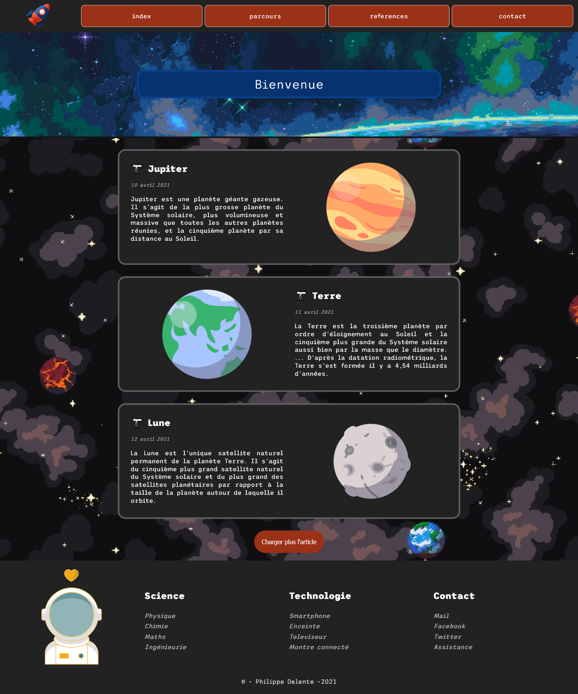
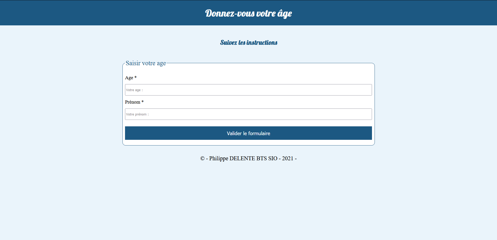
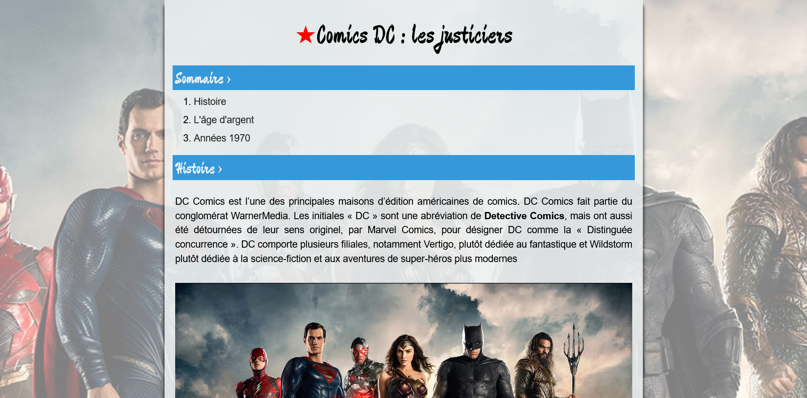

# / &gt;_ ``` TP 2021 ```

### Philippe DELENTE BTS SIO1


## Sommaire
1. [TP_BLOG](https://github.com/Limortaliter/TP_2021/blob/master/README.md#_--tp_blog)
2. [TP_AGE](https://github.com/Limortaliter/TP_2021/blob/master/README.md#_-tp_age)
3. [TP_DISTRIBUTEUR](https://github.com/Limortaliter/TP_2021/blob/master/README.md#_--tp_distributeur)
4. [TP_COMICS](https://github.com/Limortaliter/TP_2021/blob/master/README.md#_--tp_comics)

<br>

# &gt;_  `TP_BLOG`
[Voir la page d'index](https://phildaiguille.github.io/TP_2021/TP_BLOG/index.html)


<br>

#  &gt;_ `TP_AGE`
[Voir la page d'index](https://phildaiguille.github.io/TP_2021/TP_Age/form_age.html )




<br>

# &gt;_  `TP_DISTRIBUTEUR`


[Voir la page d'index](https://phildaiguille.github.io/TP_2021/TP_Banque/Distributeur.html)


<br>

# &gt;_  `TP_COMICS`


[Voir la page d'index](https://phildaiguille.github.io/TP_2021/TP_Batman/index.html)

